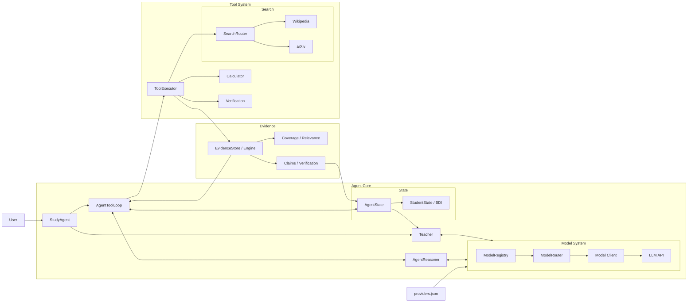
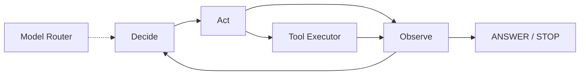
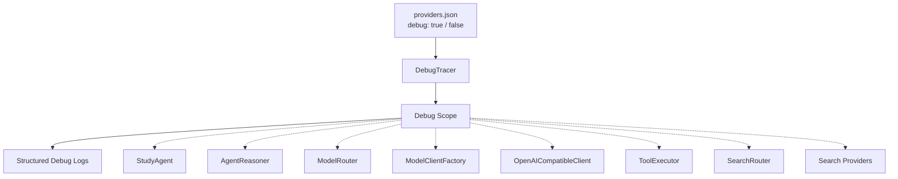

## Architecture



## Agent Reasoning Loop



## Debug Structure




## Run

Install runtime dependencies:

```bash
pip install -r requirements.txt
```

For development and tests:

```bash
pip install -r requirements-dev.txt
pytest -q
```

The root entry point delegates to the Study Agent CLI:

```bash
python main.py
```

Copy `config/providers.example.json` to `config/providers.json` and fill in the required provider credentials.

Set `"debug": true` in `providers.json` to enable execution tracing. Debug output records model routing, search fallback, evidence assessment, verification gates, learner-state updates, knowledge-graph changes, and Teacher context sizes.

Paid models are disabled by default. Use `python main.py --allow-paid` only when paid-model use is explicitly intended.


## Current Module Responsibilities

- **TaskAnalyzer**：一次性的语义任务理解，不决定搜索来源或搜索顺序。
- **AgentReasoner**：每轮唯一的动态决策中心，负责决定 SEARCH / CALCULATE / VERIFY / ASSESS / ANSWER / STOP。
- **ToolExecutor / SearchRouter**：执行工具和搜索，不替 Reasoner 决策。
- **EvidenceEngine / EvidenceStore**：标准化、去重、相关性、coverage 与结构化 VERIFY；VERIFY 不是事实证明。
- **KnowledgeGraph**：保存概念关系与学习者状态；搜索 provenance 与 learner concept 分离。
- **AssessmentEvaluator**：对 ASSESS 的答案做保守、可重复的评分；显式 assessment 才能更新学习图谱。
- **Teacher**：在 Reasoner 最终答案之后做教学表达，并优先使用当前学生状态、知识图谱和已验证 claims。
- **ModelRegistry / ModelRouter**：维护模型运行统计、连续失败冷却和能力路由；默认禁止付费模型。
- **DebugTracer**：提供跨模块结构化执行轨迹。开启 `providers.json` 的 `debug` 后，可观察分析、决策、工具、搜索恢复、证据核查、学习状态、模型冷却和 Teacher 上下文。
