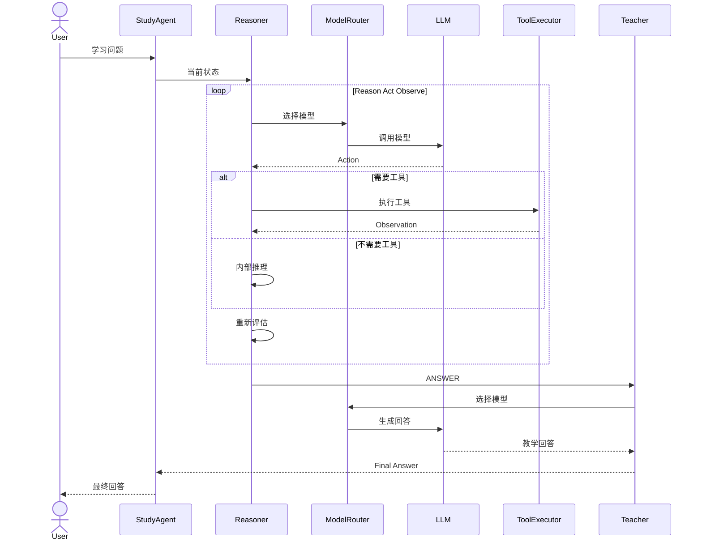

## Agent Loop

```mermaid
sequenceDiagram
    actor User
    participant Agent as StudyAgent
    participant Reasoner
    participant Router as ModelRouter
    participant Model as LLM
    participant Tool as ToolExecutor
    participant Teacher

    User->>Agent: 学习问题
    Agent->>Reasoner: 当前状态

    loop Reason Act Observe
        Reasoner->>Router: 选择模型
        Router->>Model: 调用模型
        Model-->>Reasoner: Action

        alt 需要工具
            Reasoner->>Tool: 执行工具
            Tool-->>Reasoner: Observation
        else 不需要工具
            Reasoner->>Reasoner: 内部推理
        end

        Reasoner->>Reasoner: 重新评估
    end

    Reasoner->>Teacher: ANSWER
    Teacher->>Router: 选择模型
    Router->>Model: 生成回答
    Model-->>Teacher: 教学回答
    Teacher-->>Agent: Final Answer
    Agent-->>User: 最终回答
```