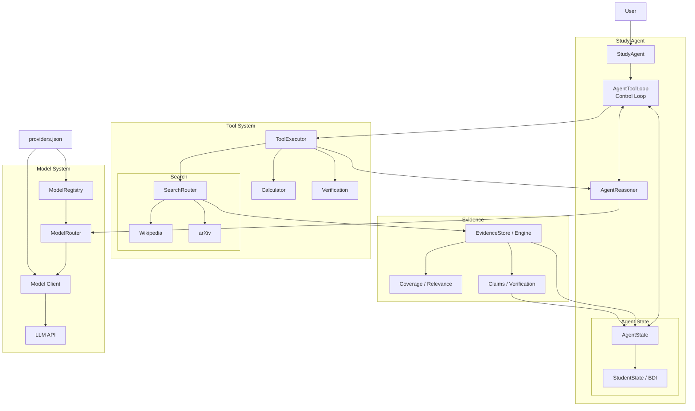
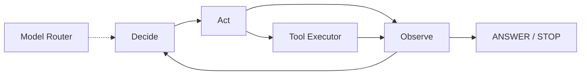
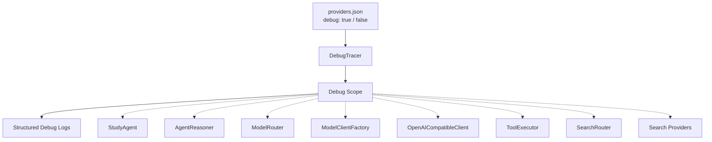

## Architecture

```mermaid
flowchart TB

    USER["User"]

    subgraph AGENT["Study Agent"]
        SA["StudyAgent"]
        LOOP["AgentToolLoop<br/>Control Loop"]
        REASONER["AgentReasoner"]

        subgraph STATE["Agent State"]
            AS["AgentState"]
            STUDENT["StudentState / BDI"]
        end

        SA --> LOOP
        LOOP <--> REASONER
        LOOP <--> AS
        AS --> STUDENT
    end

    subgraph MODEL["Model System"]
        REGISTRY["ModelRegistry"]
        ROUTER["ModelRouter"]
        CLIENT["Model Client"]
        LLM["LLM API"]

        REGISTRY --> ROUTER
        ROUTER --> CLIENT
        CLIENT --> LLM
    end

    subgraph TOOLS["Tool System"]
        EXECUTOR["ToolExecutor"]

        subgraph SEARCH["Search"]
            SEARCH_ROUTER["SearchRouter"]
            WIKI["Wikipedia"]
            ARXIV["arXiv"]
            SEARCH_ROUTER --> WIKI
            SEARCH_ROUTER --> ARXIV
        end

        CALC["Calculator"]
        VERIFY["Verification"]
        
        EXECUTOR --> SEARCH_ROUTER
        EXECUTOR --> CALC
        EXECUTOR --> VERIFY
    end

    subgraph EVIDENCE["Evidence"]
        EVI["EvidenceStore / Engine"]
        COVERAGE["Coverage / Relevance"]
        CLAIM["Claims / Verification"]

        EVI --> COVERAGE
        EVI --> CLAIM
    end

    CONFIG["providers.json"] --> REGISTRY
    CONFIG --> CLIENT

    USER --> SA
    REASONER --> ROUTER
    LOOP --> EXECUTOR
    EXECUTOR --> REASONER

    SEARCH_ROUTER --> EVI
    EVI --> AS
    CLAIM --> AS
```

## Agent Reasoning Loop

```mermaid
flowchart LR

    D["Decide"]
    A["Act"]
    O["Observe"]
    FINISH["ANSWER / STOP"]

    D --> A
    A --> O
    O --> D
    O --> FINISH

    MR["Model Router"]
    TOOLS["Tool Executor"]

    MR -.-> D
    A --> TOOLS
    TOOLS --> O
```

## Debug Structure

```mermaid
flowchart TB

    TRACE["DebugTracer"]
    DEBUG_CONFIG["providers.json<br/>debug: true / false"]
    SCOPE["Debug Scope"]
    LOG["Structured Debug Logs"]

    DEBUG_CONFIG --> TRACE
    TRACE --> SCOPE
    SCOPE --> LOG

    SCOPE -.-> SA["StudyAgent"]
    SCOPE -.-> REASONER["AgentReasoner"]
    SCOPE -.-> ROUTER["ModelRouter"]
    SCOPE -.-> FACTORY["ModelClientFactory"]
    SCOPE -.-> CLIENT["OpenAICompatibleClient"]
    SCOPE -.-> EXECUTOR["ToolExecutor"]
    SCOPE -.-> SEARCH["SearchRouter"]
    SCOPE -.-> PROVIDERS["Search Providers"]
```
