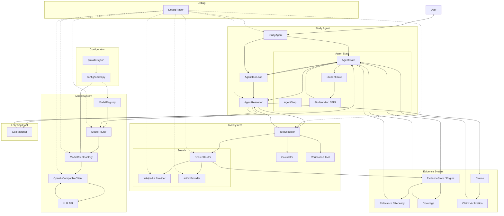
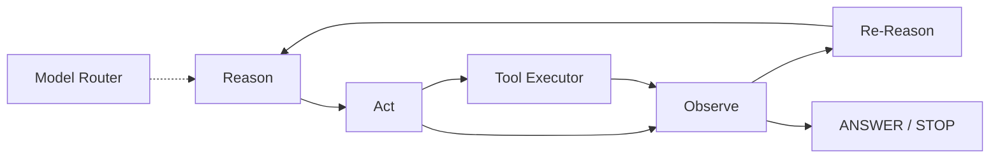

## Architecture

```mermaid
flowchart TB

    USER["User"]

    subgraph CONFIG["Configuration"]
        CFG["providers.json"]
        LOADER["config/loader.py"]
        CFG --> LOADER
    end

    subgraph AGENT["Study Agent"]
        SA["StudyAgent"]

        subgraph STATE["Agent State"]
            AS["AgentState"]
            STEP["AgentStep"]
            STUDENT["StudentState"]
            MIND["StudentMind / BDI"]
        end

        LOOP["AgentToolLoop"]
        REASONER["AgentReasoner"]

        SA --> AS
        SA --> LOOP
        LOOP --> REASONER
        AS --> LOOP
        LOOP --> AS
        AS --> STUDENT
        STUDENT --> MIND
        MIND --> AS
    end

    subgraph MODEL["Model System"]
        REGISTRY["ModelRegistry"]
        ROUTER["ModelRouter"]
        FACTORY["ModelClientFactory"]
        CLIENT["OpenAICompatibleClient"]
        LLM["LLM API"]

        REGISTRY --> ROUTER
        ROUTER --> FACTORY
        FACTORY --> CLIENT
        CLIENT --> LLM
        LLM --> CLIENT
    end

    subgraph TOOLS["Tool System"]
        EXECUTOR["ToolExecutor"]

        subgraph SEARCH["Search"]
            SEARCH_ROUTER["SearchRouter"]
            WIKI["Wikipedia Provider"]
            ARXIV["arXiv Provider"]

            SEARCH_ROUTER --> WIKI
            SEARCH_ROUTER --> ARXIV
        end

        CALC["Calculator"]
        VERIFY["Verification Tool"]

        EXECUTOR --> SEARCH_ROUTER
        EXECUTOR --> CALC
        EXECUTOR --> VERIFY
    end

    subgraph EVIDENCE["Evidence System"]
        EVI["EvidenceStore / Engine"]
        RELEVANCE["Relevance / Recency"]
        COVERAGE["Coverage"]
        CLAIM["Claims"]
        CHECK["Claim Verification"]

        EVI --> RELEVANCE
        EVI --> COVERAGE
        CLAIM --> CHECK
        CHECK --> AS
        RELEVANCE --> AS
        COVERAGE --> AS
    end

    subgraph GOAL["Learning Goal"]
        GOALMATCH["GoalMatcher"]
    end

    subgraph DEBUG["Debug"]
        TRACE["DebugTracer"]
    end

    USER --> SA

    LOADER --> REGISTRY
    LOADER --> FACTORY

    REASONER --> ROUTER
    REASONER --> EXECUTOR
    EXECUTOR --> REASONER

    SEARCH_ROUTER --> EVI
    EVI --> AS

    REASONER --> CLAIM
    REASONER --> GOALMATCH
    GOALMATCH --> AS

    AS --> REASONER

    TRACE -.-> SA
    TRACE -.-> REASONER
    TRACE -.-> ROUTER
    TRACE -.-> FACTORY
    TRACE -.-> CLIENT
    TRACE -.-> EXECUTOR
    TRACE -.-> SEARCH_ROUTER
    TRACE -.-> WIKI
    TRACE -.-> ARXIV
```

## Agent Reasoning Loop

```mermaid
flowchart LR

    R["Reason"]
    A["Act"]
    O["Observe"]
    RR["Re-Reason"]
    FINISH["ANSWER / STOP"]

    R --> A
    A --> O
    O --> RR
    RR --> R
    O --> FINISH

    MR["Model Router"]
    TOOLS["Tool Executor"]

    MR -.-> R
    A --> TOOLS
    TOOLS --> O
```
