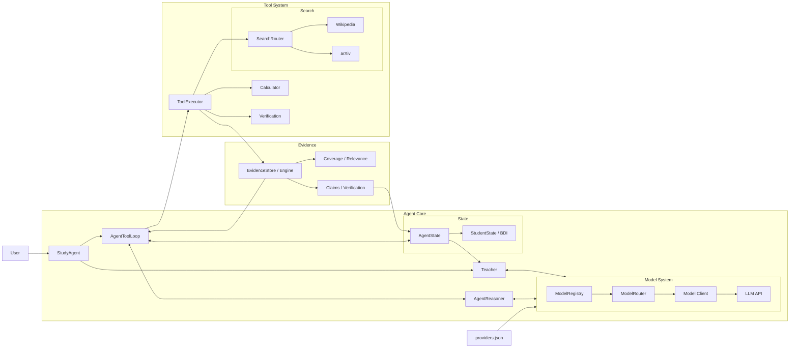
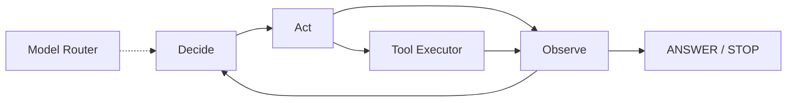
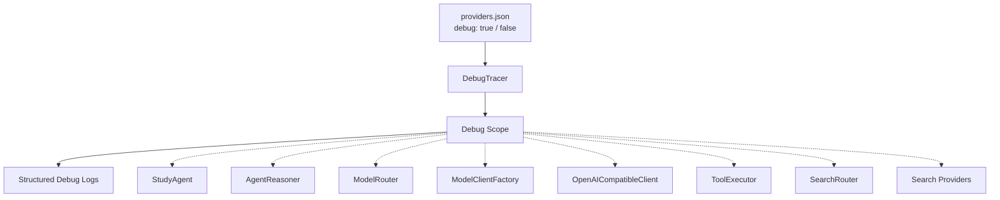

## Architecture



## Agent Reasoning Loop



## Debug Structure




## Run

Install runtime dependencies:

```bash
pip install -r requirements.txt
```

For development and tests:

```bash
pip install -r requirements-dev.txt
pytest -q
```

The root entry point delegates to the Study Agent CLI:

```bash
python main.py
```

Copy `config/providers.example.json` to `config/providers.json` and fill in the required provider credentials.

Set `"debug": true` in `providers.json` to enable execution tracing. Debug output records model routing, search fallback, evidence assessment, verification gates, learner-state updates, knowledge-graph changes, and Teacher context sizes.

Paid models are disabled by default. Use `python main.py --allow-paid` only when paid-model use is explicitly intended.
