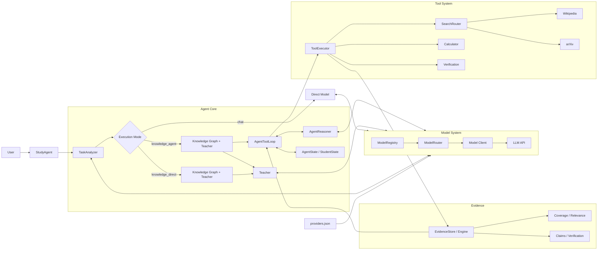
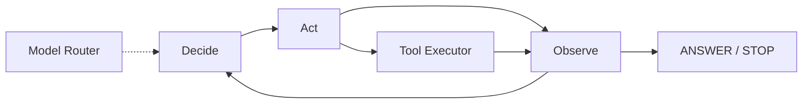
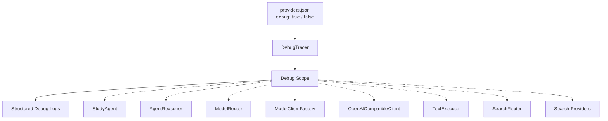

# Study Agent

一个面向**学习场景的自主智能体（Study Agent）研究原型**。

## Architecture


```mermaid
flowchart LR

    USER["User"] --> SA["StudyAgent"]
    SA --> TA["TaskAnalyzer"]
    TA --> ROUTE{"Execution Mode"}
    ROUTE -->|chat| CHAT["Direct Model"]
    ROUTE -->|knowledge_direct| KD["Knowledge Graph + Teacher"]
    ROUTE -->|knowledge_agent| KG["Knowledge Graph + Teacher"]
    KG --> LOOP["AgentToolLoop"]

    subgraph CORE["Agent Core"]
        TA
        ROUTE
        LOOP <--> REASONER["AgentReasoner"]
        AS["AgentState / StudentState"]
        LOOP <--> AS
        TEACHER["Teacher"]
        KD --> TEACHER
        KG --> TEACHER
    end

    subgraph MODEL["Model System"]
        direction LR
        REGISTRY["ModelRegistry"] --> ROUTER["ModelRouter"] --> CLIENT["Model Client"] --> LLM["LLM API"]
    end

    subgraph EVIDENCE["Evidence"]
        EVI["EvidenceStore / Engine"]
        COVERAGE["Coverage / Relevance"]
        CLAIM["Claims / Verification"]
        EVI --> COVERAGE
        EVI --> CLAIM
    end

    subgraph TOOLS["Tool System"]
        EXECUTOR["ToolExecutor"]
        SEARCH["SearchRouter"]
        WIKI["Wikipedia"]
        ARXIV["arXiv"]
        CALC["Calculator"]
        VERIFY["Verification"]
        EXECUTOR --> SEARCH
        SEARCH --> WIKI
        SEARCH --> ARXIV
        EXECUTOR --> CALC
        EXECUTOR --> VERIFY
    end

    CONFIG["providers.json"] --> MODEL
    TA <--> MODEL
    CHAT <--> MODEL
    TEACHER <--> MODEL
    REASONER <--> MODEL
    LOOP --> EXECUTOR
    EXECUTOR --> EVI
    EVI --> LOOP
```

核心执行思想是：

```text
Question
   ↓
Task Analysis
   ↓
Execution Mode
   ├── CHAT
   │    └── Direct Model
   │
   ├── KNOWLEDGE_DIRECT
   │    └── Knowledge Graph → Teacher → Answer
   │
   └── KNOWLEDGE_AGENT
        └── Knowledge Graph → Teacher → AgentToolLoop
                                      ↓
                               Search / Calculate / Verify
```

## Agent Reasoning Loop


```mermaid
flowchart LR

    D["Decide"]
    A["Act"]
    O["Observe"]
    FINISH["ANSWER / STOP"]

    D --> A
    A --> O
    O --> D
    O --> FINISH

    MR["Model Router"]
    TOOLS["Tool Executor"]

    MR -.-> D
    A --> TOOLS
    TOOLS --> O
```

## Debug Structure


```mermaid
flowchart TB

    TRACE["DebugTracer"]
    DEBUG_CONFIG["providers.json<br/>debug: true / false"]
    SCOPE["Debug Scope"]
    LOG["Structured Debug Logs"]

    DEBUG_CONFIG --> TRACE
    TRACE --> SCOPE
    SCOPE --> LOG

    SCOPE -.-> SA["StudyAgent"]
    SCOPE -.-> REASONER["AgentReasoner"]
    SCOPE -.-> ROUTER["ModelRouter"]
    SCOPE -.-> FACTORY["ModelClientFactory"]
    SCOPE -.-> CLIENT["OpenAICompatibleClient"]
    SCOPE -.-> EXECUTOR["ToolExecutor"]
    SCOPE -.-> SEARCH["SearchRouter"]
    SCOPE -.-> PROVIDERS["Search Providers"]
```

## Project Positioning

这是一个面向**学习场景的自主智能体（Study Agent）研究原型**。

它不是简单地把 LLM 接到搜索引擎上，而是尝试回答一个更具体的问题：

> **如果一个 Agent 需要长期帮助一个学生学习，它应该如何理解任务、选择模型和工具、获取并评估证据、维护学生知识状态，并根据学习者状态组织最终教学？**

目前项目仍然是本科阶段的研究型原型，但已经形成了比较完整的 **Reason → Act → Observe → Learn / Teach** 闭环，并通过自动化测试验证核心模块之间的协作。

### 为什么值得研究

这个项目主要处在三个方向的交叉位置：

1. **Agent Systems**：LLM 不只是一次性生成答案，而是作为动态决策器参与多轮工具调用。
2. **Evidence-aware Reasoning**：把检索证据、相关性、coverage、claims 和 verification 显式纳入 Agent 状态。
3. **Personalized Learning / Learner Modeling**：同时维护知识概念关系和学习者状态，让教学决策能够面向具体学生。

因此，项目真正值得讨论的不是“能不能调用 LLM”，而是：

> **如何让一个无状态的问答程序逐渐成为具有工具使用、证据管理、学习者建模和自适应教学能力的学习系统。**

## Core Reasoning Loop

```
                ┌──────────────┐
                │    Reason    │
                │  当前该做什么？ │
                └──────┬───────┘
                       ↓
                ┌──────────────┐
                │     Act      │
                │ Search/Calc/ │
                │ Verify/...   │
                └──────┬───────┘
                       ↓
                ┌──────────────┐
                │   Observe    │
                │ 结果/证据/错误 │
                └──────┬───────┘
                       ↓
                ┌──────────────┐
                │ Update State │
                │ evidence /   │
                │ learner / KG │
                └──────┬───────┘
                       │
                       └──────→ Reason
```

AgentReasoner 是动态决策中心，ToolExecutor 只负责执行。这样把“决定做什么”和“真正执行工具”分离，便于测试、替换模型和研究不同 Agent 策略。

## Module Responsibilities

### TaskAnalyzer — 任务理解

负责第一次理解用户任务：task type、domain、goal、knowledge gaps、外部事实需求、推荐工具以及 execution mode。

它决定任务进入普通聊天、直接教学还是完整 Harness；它不负责决定每一步具体搜索什么。

### AgentReasoner — 动态决策

每一轮根据当前状态决定：

```
SEARCH / CALCULATE / VERIFY / ASSESS / ANSWER / STOP
```

Reasoner 可以根据上一轮工具结果改变下一步行为，因此不是固定 pipeline。

### ToolExecutor / SearchRouter — 工具执行

负责执行 Reasoner 的工具决策，包括 arXiv、Wikipedia、Calculator 和 Verification，并处理工具错误、搜索失败以及重复调用。

### EvidenceEngine / EvidenceStore — 证据管理

负责结果标准化、去重、relevance assessment、coverage、provenance 和 claim/verification。

一个重要设计是：

> **Coverage 不等于事实证明，VERIFY 也不是回答的硬门槛。**

系统允许 Agent 在证据不完整时回答，同时明确标记没有得到当前检索证据直接支持的内容。

### KnowledgeGraph — 知识与学习状态

KnowledgeGraph 同时保存两个层面：

```
知识层：
上下文缓存 → LLM推理 → KV Cache → Prefix Caching

学习者层：
学生 → 已掌握 / 熟悉 / 刚学习 / 不熟悉
```

因此它不只是知识关系数据库，而是在尝试建立 **Concept Graph + Learner Model**。

### AssessmentEvaluator — 学习状态更新

Assessment 不采用“一次答对 = 掌握、一次答错 = 不会”的简单规则，而是结合题目难度、正确程度和当前状态进行保守更新。

更高难度题目的完全正确结果才能支持更高等级的 mastery。

### Teacher — 教学层

Teacher 与 Reasoner 的职责不同：

- **Reasoner**：决定 Agent 下一步做什么。
- **Teacher**：决定如何把结果教给学生。

Teacher 会参考学生状态、Knowledge Graph、任务、搜索证据和已验证 claims，目标不是简单改写答案，而是生成适合当前学习者的解释。

### ModelRegistry / ModelRouter — 模型路由

Router 综合 task type、capability、静态模型信息、运行时成功/失败、failure streak 和 cooldown 选择模型。

默认禁止付费模型，只有显式允许时才可以使用。

### DebugTracer — 可观测性

DebugTracer 记录：

```
Task Analysis
    ↓
Model Routing
    ↓
Reasoning
    ↓
Tool Call
    ↓
Search / Evidence
    ↓
State Update
    ↓
Teacher
```

对于研究型 Agent，可观测性很重要：最终答案正确并不能证明中间决策正确。

## What Has Been Tested

当前测试体系覆盖：

- TaskAnalyzer
- AgentReasoner
- AgentToolLoop
- SearchStrategy / SearchRouter
- arXiv / Wikipedia provider
- EvidenceEngine
- KnowledgeGraph
- Learner / Assessment
- Teacher
- ModelRegistry / ModelRouter
- OpenAI-compatible API
- SSE streaming
- timeout / cooldown / failure recovery

重点不仅是测试函数返回值，还测试模型失败、搜索失败、证据不足、重复工具调用等情况下，模块之间能否继续形成稳定闭环。

运行：

```bash
pytest -q
```

## Research Value

### Adaptive Execution

项目现在不再默认让所有输入进入完整 Harness，而是根据任务性质选择执行深度：

```text
CHAT
    → Direct Model

KNOWLEDGE_DIRECT
    → Knowledge Graph + Teacher

KNOWLEDGE_AGENT
    → Knowledge Graph + Teacher + AgentToolLoop
```

`StudyAgent` 支持 `execution_mode_override`，可以在保持同一任务集、模型和用户状态的条件下强制指定路径，用于构造严格对照组。

`AgentState.metrics` 会记录路由结果、TaskAnalyzer 时间和执行时间，后续可以继续扩展任务完成率、工具调用数、Token/成本等实验指标。


如果把这个项目给博士生看，最值得展示的不是代码量，而是其中可以继续形成实验的问题。

### 1. Learner-aware Agent

普通 Agent 可以抽象成：

```
Question → Reason → Tool → Answer
```

Study Agent 尝试扩展为：

```
Question
   ↓
Reason
   ↓
Tool / Evidence
   ↓
State Update
   ↓
Learner Model
   ↓
Teaching
   ↓
下一次学习
```

自然的问题是：

> **Agent 如何利用历史学习状态改变未来的决策，而不仅仅改变最终回答的措辞？**

例如两个学生都问 Transformer：一个已经掌握 Self-Attention，另一个只理解矩阵乘法。理想情况下，Agent 应该生成不同的学习路径。

### 2. Evidence-aware Agent

系统把：

```
LLM knowledge
+
Retrieved evidence
+
Verification result
```

显式分开。

可以进一步研究：

> **Agent 在什么条件下应该相信参数知识、什么时候必须检索、什么时候应该继续验证？**

这比简单的 RAG 更接近证据驱动的 Agent 决策。

### 3. Adaptive Model Routing

不同模型在不同任务上的能力不同，而且模型表现也会随运行历史变化。

当前 Router 已经记录 task capability、runtime success/failure、failure streak 和 cooldown。

进一步可以研究：

> **能否让 Agent 从历史任务中学习任务—模型能力矩阵，并动态选择模型？**

这可以自然扩展到 contextual bandit、online learning 或 cost-aware routing。

### 4. Knowledge Graph + Learner Model

项目尝试把：

```
Knowledge Graph
        +
Learner Cognitive State
        ↓
Personalized Teaching
```

结合起来。

例如学生已经理解矩阵乘法，但不了解 Attention，Agent 就不需要重新讲所有矩阵知识，而可以直接建立 Attention 与已有知识之间的联系。

核心研究问题是：

> **如何把普通知识图谱转化为特定学习者的动态知识状态图？**

### 5. Agent-level Evaluation

目前工程测试可以回答“模块有没有坏”，但不能充分回答“这个 Agent 是否真的更好”。

下一阶段可以建立 quantitative evaluation：

- task completion rate
- unnecessary tool calls
- search efficiency
- evidence precision / recall
- learner-state update accuracy
- teaching quality
- personalization gain
- model-routing cost
- failure recovery rate

如果进一步加入 baseline，例如无 Learner Model、无 Evidence、固定模型路由等，就可以真正比较不同机制对学习效果的贡献。

## Current Limitations

这个项目目前仍然是**研究原型，而不是经过大规模实验验证的科研系统**。

明确限制包括：

1. **Evidence verification 仍主要是结构化 / lexical matching**，还不是成熟的 semantic entailment system。
2. **Learner model 仍较简单**，主要依赖显式 assessment，还没有形成长期行为数据驱动的认知模型。
3. **Knowledge Graph 自动构建仍依赖 LLM**，关系抽取和置信度需要更严格评估。
4. **Model Router 目前是启发式 + runtime statistics**，还不是经过大规模实验训练的 routing policy。
5. **Evaluation 目前以工程测试为主**，还需要真实学习任务、baseline 和 quantitative evaluation。

这些限制也正好定义了后续研究空间。

## Possible Research Roadmap

```
工程化 Agent Prototype
        ↓
Agent-level Evaluation
        ↓
Learner Model Benchmark
        ↓
Evidence-aware Decision Policy
        ↓
Adaptive Model Routing
        ↓
Personalized Learning Agent
```

如果继续做，我认为最值得优先研究的是：

> **Learner Model 如何真正改变 Agent 的决策，而不仅仅改变回答措辞。**

如果实验能够证明引入 Student Model 后，Agent 可以减少重复教学、降低无效搜索，并提高后续学习任务的表现，那么项目就可以从“较完整的 Agent 工程原型”进一步进入**可实验验证的个性化学习 Agent 研究**。

## Run

Install runtime dependencies:

```bash
pip install -r requirements.txt
```

For development and tests:

```bash
pip install -r requirements-dev.txt
pytest -q
```

The root entry point delegates to the Study Agent CLI:

```bash
python main.py
```

For offline module diagnostics (no LLM API and no network):

```bash
python examples/module_demos.py
```

It prints each module's key output and ends with ALL MODULE DEMOS PASSED when all deterministic checks succeed.

Copy config/providers.example.json to config/providers.json and fill in the required provider credentials.

Set debug: true in providers.json to enable execution tracing.

Paid models are disabled by default. Use:

```bash
python main.py --allow-paid
```

only when paid-model use is explicitly intended.

## Web UI / Open WebUI

The repository can be exposed to Open WebUI without changing the Study Agent core.

```
Open WebUI
    ↓
/v1/chat/completions
    ↓
examples/study_agent_api.py
    ↓
StudyAgent
```

Start the API:

```bash
python examples/study_agent_api.py
```

Endpoints:

- GET /health
- GET /v1/models
- POST /v1/chat/completions

The API uses an OpenAI-compatible streaming interface. Agent status is emitted separately through reasoning_content, while the final answer is emitted through content.

When Open WebUI runs in Docker and the API runs on the Windows host, use:

```
http://host.docker.internal:8000/v1
```

## Project Structure

```
Study-agent/
├── data/
│   ├── .gitkeep
│   └── knowledge_graph.sqlite3  # 运行时生成，已由 .gitignore 忽略
├── core/
│   ├── agent.py              # Agent 主流程与状态管理
│   ├── reasoner.py           # LLM 动态决策
│   ├── tool_loop.py          # Decide → Act → Observe
│   ├── task_analyzer.py      # 初始任务分析
│   ├── teacher.py             # 教学表达
│   ├── knowledge_graph.py    # 知识图谱 + 学习状态
│   ├── evidence.py            # 证据管理
│   ├── assessment.py          # 学习评估
│   ├── model_router.py        # 模型路由
│   └── model_registry.py     # 模型运行状态
├── tools/
│   └── search/                # 搜索工具与 Provider
├── config/
│   └── providers.json         # Provider / Model 配置
├── examples/
│   ├── module_demos.py
│   └── study_agent_api.py
└── test/                      # 自动化测试
```

## Knowledge Graph Persistence

正式运行时，知识图谱使用本地 SQLite 持久化：

`data/knowledge_graph.sqlite3`

其中保存：

- 知识节点、别名和节点类型
- 有向知识关系及置信度
- 搜索证据引用
- 每个概念对应的学习者状态与 assessment history

因此关闭 Study Agent 后再次启动，之前积累的知识图谱和学习状态仍然可以恢复。`data/` 中的运行时数据默认不会提交到 Git；`data/.gitkeep` 仅用于保留目录结构。

## Project Status

当前项目已经从“LLM + Tool 调用脚本”发展成具有：

- 动态 Agent Loop
- Evidence 管理
- Knowledge Graph
- Learner Model
- Assessment
- Teacher
- Adaptive Model Routing
- Failure Recovery
- Debug Tracing
- OpenAI-compatible API
- 自动化测试

的完整研究原型。

**下一阶段的重点不应该只是继续增加模块，而应该从工程完整性转向实验验证：**

> **证明这些机制是否真的让学习 Agent 更有效、更高效、更个性化。**
