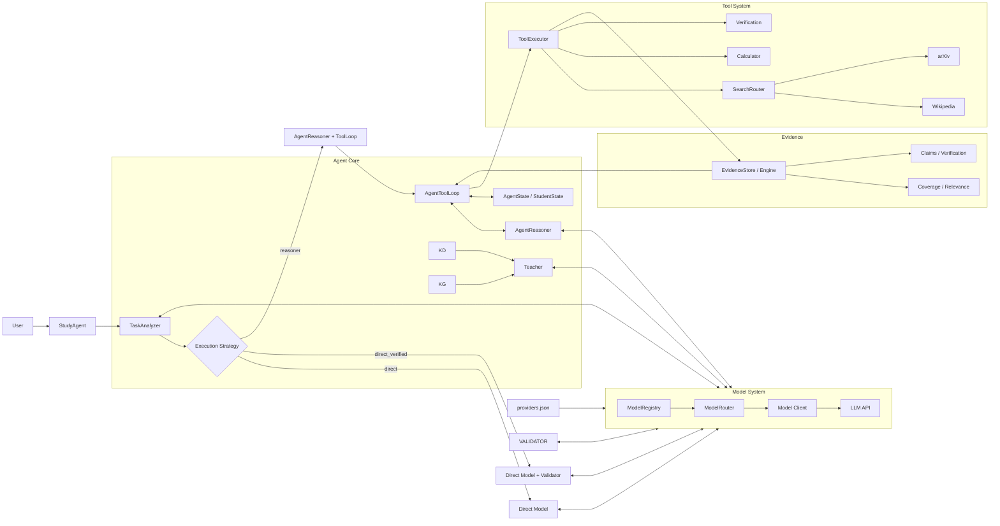
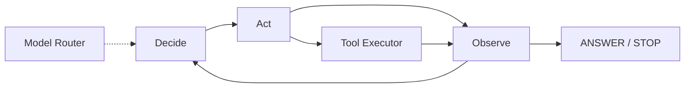
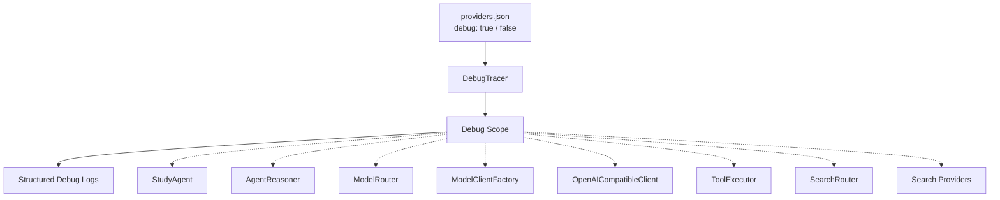

# Study Agent

一个面向**学习场景的自主智能体（Study Agent）研究原型**。

## Architecture


```mermaid
flowchart LR

    USER["User"] --> SA["StudyAgent"]
    SA --> TA["TaskAnalyzer"]
    TA --> ROUTE{"Execution Strategy"}
    ROUTE -->|direct| DIRECT["Direct Model"]
    ROUTE -->|direct_verified| VERIFIED["Direct Model + Validator"]
    ROUTE -->|reasoner| REASONER_PATH["AgentReasoner + ToolLoop"]
    REASONER_PATH --> LOOP["AgentToolLoop"]

    subgraph CORE["Agent Core"]
        TA
        ROUTE
        LOOP <--> REASONER["AgentReasoner"]
        AS["AgentState / StudentState"]
        LOOP <--> AS
        TEACHER["Teacher"]
        KD --> TEACHER
        KG --> TEACHER
    end

    subgraph MODEL["Model System"]
        direction LR
        REGISTRY["ModelRegistry"] --> ROUTER["ModelRouter"] --> CLIENT["Model Client"] --> LLM["LLM API"]
    end

    subgraph EVIDENCE["Evidence"]
        EVI["EvidenceStore / Engine"]
        COVERAGE["Coverage / Relevance"]
        CLAIM["Claims / Verification"]
        EVI --> COVERAGE
        EVI --> CLAIM
    end

    subgraph TOOLS["Tool System"]
        EXECUTOR["ToolExecutor"]
        SEARCH["SearchRouter"]
        WIKI["Wikipedia"]
        ARXIV["arXiv"]
        CALC["Calculator"]
        VERIFY["Verification"]
        EXECUTOR --> SEARCH
        SEARCH --> WIKI
        SEARCH --> ARXIV
        EXECUTOR --> CALC
        EXECUTOR --> VERIFY
    end

    CONFIG["providers.json"] --> MODEL
    TA <--> MODEL
    DIRECT <--> MODEL
    VERIFIED <--> MODEL
    VALIDATOR <--> MODEL
    TEACHER <--> MODEL
    REASONER <--> MODEL
    LOOP --> EXECUTOR
    EXECUTOR --> EVI
    EVI --> LOOP
```

核心执行思想是：

```text
Question
   ↓
Task Analysis
   ↓
ModelRouter
   ↓
Execution Strategy
   ├── DIRECT
   │    └── Direct Model
   │
   ├── DIRECT_VERIFIED
   │    └── Direct Model → TeachingValidator
   │                         ↓
   │                    revise if needed
   │
   └── REASONER
        └── AgentReasoner → ToolLoop
                 ↓
          Search / Calculate / Verify
                 ↓
              Teacher
```

这里不再存在 CHAT / KNOWLEDGE_DIRECT / KNOWLEDGE_AGENT 等固定执行模式。每个请求都进入同一个 Agent Loop；Reasoner 每一轮自行决定下一步是 ANSWER、SEARCH、CALCULATE、VERIFY、ASSESS 或 STOP。
## Agent Reasoning Loop
## Agent Reasoning Loop


```mermaid
flowchart LR

    D["Decide"]
    A["Act"]
    O["Observe"]
    FINISH["ANSWER / STOP"]

    D --> A
    A --> O
    O --> D
    O --> FINISH

    MR["Model Router"]
    TOOLS["Tool Executor"]

    MR -.-> D
    A --> TOOLS
    TOOLS --> O
```

## Debug Structure


```mermaid
flowchart TB

    TRACE["DebugTracer"]
    DEBUG_CONFIG["providers.json<br/>debug: true / false"]
    SCOPE["Debug Scope"]
    LOG["Structured Debug Logs"]

    DEBUG_CONFIG --> TRACE
    TRACE --> SCOPE
    SCOPE --> LOG

    SCOPE -.-> SA["StudyAgent"]
    SCOPE -.-> REASONER["AgentReasoner"]
    SCOPE -.-> ROUTER["ModelRouter"]
    SCOPE -.-> FACTORY["ModelClientFactory"]
    SCOPE -.-> CLIENT["OpenAICompatibleClient"]
    SCOPE -.-> EXECUTOR["ToolExecutor"]
    SCOPE -.-> SEARCH["SearchRouter"]
    SCOPE -.-> PROVIDERS["Search Providers"]
```

## Project Positioning

这是一个面向**学习场景的自主智能体（Study Agent）研究原型**。

它不是简单地把 LLM 接到搜索引擎上，而是尝试回答一个更具体的问题：

> **如果一个 Agent 需要长期帮助一个学生学习，它应该如何理解任务、选择模型和工具、获取并评估证据、维护学生知识状态，并根据学习者状态组织最终教学？**

目前项目仍然是本科阶段的研究型原型，但已经形成了比较完整的 **Reason → Act → Observe → Learn / Teach** 闭环，并通过自动化测试验证核心模块之间的协作。

### 为什么值得研究

这个项目主要处在三个方向的交叉位置：

1. **Agent Systems**：LLM 不只是一次性生成答案，而是作为动态决策器参与多轮工具调用。
2. **Evidence-aware Reasoning**：把检索证据、相关性、coverage、claims 和 verification 显式纳入 Agent 状态。
3. **Personalized Learning / Learner Modeling**：同时维护知识概念关系和学习者状态，让教学决策能够面向具体学生。

因此，项目真正值得讨论的不是“能不能调用 LLM”，而是：

> **如何让一个无状态的问答程序逐渐成为具有工具使用、证据管理、学习者建模和自适应教学能力的学习系统。**

## Core Reasoning Loop

```
                ┌──────────────┐
                │    Reason    │
                │  当前该做什么？ │
                └──────┬───────┘
                       ↓
                ┌──────────────┐
                │     Act      │
                │ Search/Calc/ │
                │ Verify/...   │
                └──────┬───────┘
                       ↓
                ┌──────────────┐
                │   Observe    │
                │ 结果/证据/错误 │
                └──────┬───────┘
                       ↓
                ┌──────────────┐
                │ Update State │
                │ evidence /   │
                │ learner / KG │
                └──────┬───────┘
                       │
                       └──────→ Reason
```

AgentReasoner 是动态决策中心，ToolExecutor 只负责执行。这样把“决定做什么”和“真正执行工具”分离，便于测试、替换模型和研究不同 Agent 策略。

## Module Responsibilities

### TaskAnalyzer — 任务理解

负责第一次理解用户任务：task type、domain、goal、knowledge gaps、外部事实需求、推荐工具、difficulty，以及是否明确要求测试。

它决定任务进入普通聊天、直接教学还是完整 Harness；它不负责决定每一步具体搜索什么。

### AgentReasoner — 动态决策

每一轮根据当前状态决定：

```
SEARCH / CALCULATE / VERIFY / ASSESS / ANSWER / STOP
```

Reasoner 可以根据上一轮工具结果改变下一步行为，因此不是固定 pipeline。

### ToolExecutor / SearchRouter — 工具执行

负责执行 Reasoner 的工具决策，包括 arXiv、Wikipedia、Calculator 和 Verification，并处理工具错误、搜索失败以及重复调用。

### EvidenceEngine / EvidenceStore — 证据管理

负责结果标准化、去重、relevance assessment、coverage、provenance 和 claim/verification。

一个重要设计是：

> **Coverage 不等于事实证明，VERIFY 也不是回答的硬门槛。**

系统允许 Agent 在证据不完整时回答，同时明确标记没有得到当前检索证据直接支持的内容。

### KnowledgeGraph — 知识与学习状态

KnowledgeGraph 同时保存两个层面：

```
知识层：
上下文缓存 → LLM推理 → KV Cache → Prefix Caching

学习者层：
学生 → 已掌握 / 熟悉 / 刚学习 / 不熟悉
```

因此它不只是知识关系数据库，而是在尝试建立 **Concept Graph + Learner Model**。

### AssessmentEvaluator — 学习状态更新

Assessment 不采用“一次答对 = 掌握、一次答错 = 不会”的简单规则，而是结合题目难度、正确程度和当前状态进行保守更新。

更高难度题目的完全正确结果才能支持更高等级的 mastery。

### Teacher — 教学层

Teacher 是教学决策与教学表达模块；其输出会继续进入独立的 TeachingValidator。只有确定的 major factual / mathematical error 才触发一次修订。

Teacher 与 Reasoner 的职责不同：

- **Reasoner**：决定 Agent 下一步做什么。
- **Teacher**：决定如何把结果教给学生。

Teacher 会参考学生状态、Knowledge Graph、任务、搜索证据和已验证 claims，目标不是简单改写答案，而是生成适合当前学习者的解释。

### ModelRegistry / ModelRouter — 模型路由

Router 综合 task type、capability、静态模型信息、运行时成功/失败、failure streak 和 cooldown 选择模型。

默认禁止付费模型，只有显式允许时才可以使用。

### DebugTracer — 可观测性

DebugTracer 记录：

```
Task Analysis
    ↓
Model Routing
    ↓
Reasoning
    ↓
Tool Call
    ↓
Search / Evidence
    ↓
State Update
    ↓
Teacher
```

对于研究型 Agent，可观测性很重要：最终答案正确并不能证明中间决策正确。

## What Has Been Tested

当前测试体系覆盖：

- TaskAnalyzer
- AgentReasoner
- AgentToolLoop
- SearchStrategy / SearchRouter
- arXiv / Wikipedia provider
- EvidenceEngine
- KnowledgeGraph
- Learner / Assessment
- Teacher
- ModelRegistry / ModelRouter
- OpenAI-compatible API
- SSE streaming
- timeout / cooldown / failure recovery

重点不仅是测试函数返回值，还测试模型失败、搜索失败、证据不足、重复工具调用等情况下，模块之间能否继续形成稳定闭环。

运行：

```bash
pytest -q
```

## Research Value

### Full Agent Loop

项目的运行时执行路径只有一条：

```text
Question
   ↓
Task Analysis
   ↓
AgentToolLoop
   ↕
AgentReasoner
   ↓
SEARCH / CALCULATE / VERIFY / ASSESS / ANSWER / STOP
   ↓
Observation → State Update → 下一轮 Reasoner
```

TaskAnalyzer 只负责提供初始任务上下文和 difficulty 等观察信息；它不决定执行路径。
ModelRouter 只负责为当前需要调用的角色选择模型与 reasoning effort；它不决定 Agent 下一步做什么。

因此即使问题非常简单，Agent 也会进入 Loop，只是 Reasoner 可能在第一轮直接选择 ANSWER。
复杂问题则可以继续搜索、计算、验证，再根据新观察重新决策。

`StudyAgent` 不提供 direct / direct_verified / reasoner 之类的运行模式。任何实验对照应替换 Reasoner policy，而不是绕过 Agent Loop。

### 1. Learner-aware Agent
### 1. Learner-aware Agent

普通 Agent 可以抽象成：

```
Question → Reason → Tool → Answer
```

Study Agent 尝试扩展为：

```
Question
   ↓
Reason
   ↓
Tool / Evidence
   ↓
State Update
   ↓
Learner Model
   ↓
Teaching
   ↓
下一次学习
```

自然的问题是：

> **Agent 如何利用历史学习状态改变未来的决策，而不仅仅改变最终回答的措辞？**

例如两个学生都问 Transformer：一个已经掌握 Self-Attention，另一个只理解矩阵乘法。理想情况下，Agent 应该生成不同的学习路径。

### 2. Evidence-aware Agent

系统把：

```
LLM knowledge
+
Retrieved evidence
+
Verification result
```

显式分开。

可以进一步研究：

> **Agent 在什么条件下应该相信参数知识、什么时候必须检索、什么时候应该继续验证？**

这比简单的 RAG 更接近证据驱动的 Agent 决策。

### 3. Adaptive Model Routing

不同模型在不同任务上的能力不同，而且模型表现也会随运行历史变化。

当前 Router 已经记录 task capability、runtime success/failure、failure streak 和 cooldown。

进一步可以研究：

> **能否让 Agent 从历史任务中学习任务—模型能力矩阵，并动态选择模型？**

这可以自然扩展到 contextual bandit、online learning 或 cost-aware routing。

### 4. Knowledge Graph + Learner Model

项目尝试把：

```
Knowledge Graph
        +
Learner Cognitive State
        ↓
Personalized Teaching
```

结合起来。

例如学生已经理解矩阵乘法，但不了解 Attention，Agent 就不需要重新讲所有矩阵知识，而可以直接建立 Attention 与已有知识之间的联系。

核心研究问题是：

> **如何把普通知识图谱转化为特定学习者的动态知识状态图？**

### 5. Agent-level Evaluation

目前工程测试可以回答“模块有没有坏”，但不能充分回答“这个 Agent 是否真的更好”。

下一阶段可以建立 quantitative evaluation：

- task completion rate
- unnecessary tool calls
- search efficiency
- evidence precision / recall
- learner-state update accuracy
- teaching quality
- personalization gain
- model-routing cost
- failure recovery rate

如果进一步加入 baseline，例如无 Learner Model、无 Evidence、固定模型路由等，就可以真正比较不同机制对学习效果的贡献。

## Current Limitations

这个项目目前仍然是**研究原型，而不是经过大规模实验验证的科研系统**。

明确限制包括：

1. **Evidence verification 仍主要是结构化 / lexical matching**，还不是成熟的 semantic entailment system。
2. **Learner model 仍较简单**，主要依赖显式 assessment，还没有形成长期行为数据驱动的认知模型。
3. **Knowledge Graph 自动构建仍依赖 LLM**，关系抽取和置信度需要更严格评估。
4. **Model Router 目前是启发式 + runtime statistics**，还不是经过大规模实验训练的 routing policy。
5. **Evaluation 目前以工程测试为主**，还需要真实学习任务、baseline 和 quantitative evaluation。

这些限制也正好定义了后续研究空间。

## Possible Research Roadmap

```
工程化 Agent Prototype
        ↓
Agent-level Evaluation
        ↓
Learner Model Benchmark
        ↓
Evidence-aware Decision Policy
        ↓
Adaptive Model Routing
        ↓
Personalized Learning Agent
```

如果继续做，我认为最值得优先研究的是：

> **Learner Model 如何真正改变 Agent 的决策，而不仅仅改变回答措辞。**

如果实验能够证明引入 Student Model 后，Agent 可以减少重复教学、降低无效搜索，并提高后续学习任务的表现，那么项目就可以从“较完整的 Agent 工程原型”进一步进入**可实验验证的个性化学习 Agent 研究**。

## Run

Install runtime dependencies:

```bash
pip install -r requirements.txt
```

For development and tests:

```bash
pip install -r requirements-dev.txt
pytest -q
```

The root entry point runs the Study Agent CLI directly:

```bash
python main.py
```

For offline module diagnostics (no LLM API and no network):

```bash
python examples/module_demos.py
```

It prints each module's key output and ends with ALL MODULE DEMOS PASSED when all deterministic checks succeed.

Copy config/providers.example.json to config/providers.json and fill in the required provider credentials.

Set debug: true in providers.json to enable execution tracing.

Paid models are disabled by default. Use:

```bash
python main.py --allow-paid
```

only when paid-model use is explicitly intended.

## Web UI / Open WebUI

The repository can be exposed to Open WebUI without changing the Study Agent core.

```
Open WebUI
    ↓
/v1/chat/completions
    ↓
examples/study_agent_api.py
    ↓
StudyAgent
```

Start the API:

```bash
python examples/study_agent_api.py
```

Endpoints:

- GET /health
- GET /v1/models
- POST /v1/chat/completions

The API uses an OpenAI-compatible streaming interface. Agent status is emitted separately through reasoning_content, while the final answer is emitted through content.

When Open WebUI runs in Docker and the API runs on the Windows host, use:

```
http://host.docker.internal:8000/v1
```

## Project Structure

```
Study-agent/
├── data/
│   ├── .gitkeep
│   └── knowledge_graph.sqlite3  # 运行时生成，已由 .gitignore 忽略
├── core/
│   ├── agent.py              # Agent 主流程与状态管理
│   ├── reasoner.py           # LLM 动态决策
│   ├── tool_loop.py          # Decide → Act → Observe
│   ├── task_analyzer.py      # 初始任务分析
│   ├── teacher.py             # 教学表达
│   ├── knowledge_graph.py    # 知识图谱 + 学习状态
│   ├── evidence.py            # 证据管理
│   ├── assessment.py          # 学习评估
│   ├── model_router.py        # 模型路由
│   └── model_registry.py     # 模型运行状态
├── tools/
│   └── search/                # 搜索工具与 Provider
├── config/
│   └── providers.json         # Provider / Model 配置
├── examples/
│   ├── module_demos.py        # 离线模块演示
│   └── study_agent_api.py     # OpenAI-compatible API 外壳
└── test/                      # 自动化测试
```


## Python Coder Agent

仓库现在额外提供一个独立的 Python Coding Agent。它复用现有 BrowserModel 调用 DeepSeek Web，但拥有独立的 Coding Harness，不会把代码执行权限加入 StudyAgent 的普通工具系统。

固定工作空间：

`D:\Coder_workspace`

第一版能力：

```text
Search
  ↓
Read Python
  ↓
Plan
  ↓
Patch / Write
  ↓
Create pytest
  ↓
Run pytest in Docker sandbox
  ↓
Observe failure
  ↓
Repair
  ↓
Run pytest again
  ↓
Verify Goal
  ↓
Finish
```

安全边界：

- Coder 文件 API 只接受 workspace 相对路径，拒绝绝对路径、`..`、reparse point、敏感凭据文件以及 workspace 外的路径。
- 模型不能提交 shell command；RUN_PYTHON / RUN_PYTEST 只接受经过 Harness 校验的相对文件路径。
- Python 执行要求本地镜像 `study-agent-coder-python:1` 已存在，运行时使用 `--pull=never`、`--network none`、只读镜像根文件系统、丢弃 Linux capabilities、禁止提权、CPU/RAM/PID/输出上限。
- 容器拿到的是经过过滤的 workspace 副本，而不是原始 workspace 的可写挂载；敏感文件不会进入执行环境。
- Coder 默认必须实际修改代码、创建 pytest，并在最后一次修改之后通过 pytest，才能进入 FINISH。
- 没有可信 Docker 沙箱时，Coder 不执行 Python/pytest，而是 fail-closed。

构建安全执行镜像（首次使用）：

```powershell
docker build -t study-agent-coder-python:1 coder
```

运行：

```powershell
python examples/coder_agent.py "修复 xxx，并添加 pytest 回归测试"
```

Coder 当前是独立 Agent；后续可以让 StudyAgent 在识别到 coding 任务后把任务转交给 Coder，而不改变现有学习 Agent 的工具权限。

## Adaptive Model + Reasoning Effort Routing

当前模型路由分成两个相互独立的问题：

`text
1. Which model?
2. How much reasoning effort?
`

整体流程为：

`text
Question
   ↓
TaskAnalyzer
   ├── task type / domain / tools / external facts
   └── difficulty 1~5
           ↓
       ModelRouter
       ├── model: runtime capability reliability
       └── effort: difficulty + benchmark curve
           ↓
   Reasoner / Teacher / Direct Model
`

### 为什么不让 Reasoner 自己选择模型？

Reasoner 必须先由某个模型运行，才能产生下一步决策。因此让 Reasoner 在第一次调用时决定“应该使用哪个模型”会形成循环依赖：

`text
先选模型
   ↓
才能运行 Reasoner
   ↓
Reasoner 才能选模型
`

当前实现因此把两个决策分开：

- **TaskAnalyzer / pre-reasoner stage**：先理解问题并估计 difficulty。
- **ModelRouter**：根据 difficulty 和模型运行历史决定模型及 effort。
- **AgentReasoner**：拿到已经选择的模型后，只负责决定下一步 action。
- **Teacher**：拿到已经选择的教学模型后，负责组织学习解释。

因此：

> **Reasoner 决定“做什么”，Router 决定“谁来做”。**

这也使不同 routing policy 可以在相同任务集上做严格对照。

### difficulty 是如何得到的？

TaskAnalyzer 本身就是“便宜的前置评估器”。在没有 task analysis 之前，它默认使用较低的 effort 来完成最初的任务分析，避免为了估计难度而先支付高 reasoning 成本。

它输出：

`text
difficulty ∈ {1,2,3,4,5}
`

这个难度不是心理学意义上的真实“问题难度”，而是 Router 使用的**任务复杂度估计**，当前依据包括：

- 任务类型与目标
- 是否需要外部事实
- 是否需要搜索 / 计算 / 验证
- 是否存在多步推理需求
- TaskAnalyzer 对任务复杂度的结构化判断

因此 README 和实验中应该把它称为 **estimated task difficulty**，而不是客观难度标签。

### Model selection：只使用 runtime reliability

当前模型顺序不再由多个静态因素加权得到。

主要依据是：

`text
capability-specific runtime reliability
`

例如：

`text
reasoning capability
    model A: 真实调用成功率较高
    model B: 真实调用成功率较低

teaching capability
    model A: teaching role 的历史表现
    model B: teaching role 的历史表现
`

reasoning 和 teaching 可以因此得到不同的模型顺序。

runtime reliability 使用平滑统计，避免一个模型只成功 1 次或失败 1 次就被错误地排到极端位置。

### Effort selection：difficulty + benchmark curve

模型选定后，再决定使用多少 reasoning effort。

当前支持的逻辑是：

`text
difficulty 1 → minimal
difficulty 2 → low
difficulty 3 → high
difficulty 4 → high
difficulty 5 → max
`

如果某个模型至少有两个已测 benchmark effort 点，则 Router 会尝试选择达到当前难度目标所需的**最低实测 effort**。

当前目标保留比例为：

| Difficulty | Target benchmark retention |
|---|---:|
| 1 | 70% |
| 2 | 78% |
| 3 | 86% |
| 4 | 93% |
| 5 | 100% |

这些比例是当前研究原型中的启发式参数，不是官方 benchmark 标准。

如果只有一个 benchmark 点，Router **不会推测缺失 effort 的分数**，而是退回到透明的 difficulty → supported effort 规则。

---

## What is reasoning effort?

Reasoning effort 是模型 API 提供的离散推理强度控制参数。

它不是统一的百分比：

`text
low = 20%
medium = 50%
high = 80%
`

这种解释是不成立的，因为不同模型对 effort 的定义和支持档位并不完全相同。

例如 OpenAI GPT-5.6 系列当前公开支持：

`text
none / low / medium / high / xhigh / max
`

DeepSeek V4 的 Thinking 接口支持更少的实际档位，并对部分兼容值进行映射。

因此本项目把 effort 作为**模型特定的离散控制变量**，并在 config/model_profiles.json 中记录模型已知的 effort 档位。

真正实验时，还应该记录：

`text
model
provider
effort
task
latency
reasoning tokens（若 provider 可提供）
total tokens
quality
cost
`

这样才能分析“更高 effort 带来了多少质量收益，以及付出了多少成本”。

---

## Public Benchmark Profiles

Benchmark 文件：

`text
config/model_profiles.json
`

当前记录的是 Artificial Analysis Intelligence Index 的公开结果。**这些分数不是本项目自己的实验结果，而是 routing 的静态先验。**

主要已记录模型：

| Model | Published effort benchmark points |
|---|---|
| GPT-5.6 Sol | none 28 / low 34 / medium 39 / high 42 / xhigh 44 / max 47 |
| GPT-5.6 Terra | none 22 / low 28 / medium 30 / high 34 / xhigh 38 / max 42 |
| GPT-5.6 Luna | none 16 / low 21 / medium 25 / high 32 / xhigh 35 / max 37 |
| GPT-5 mini | minimal 10 / medium 21 / high 17 |
| DeepSeek V4 Pro 0813 | max 36 |
| DeepSeek V4 Flash 0420 | max 24 |
| DeepSeek V4 Flash 0731 | max 50 |
| GLM-5.3 | low 34 / max 45 |
| GLM-5.3 Flash | max 42 |
| Kimi K3 | low 34 / max 44 |
| Qwen3.8 Max 0902 | max 45 |

### Benchmark data policy

项目遵循三个约束：

1. **模型版本必须对应。**
2. **缺少 benchmark 的 effort 档位保持 unknown。**
3. **Router 不根据一个已知点虚构整个 effort curve。**

例如：

`text
deepseek/deepseek-v4-flash
    → V4 Flash 0420

deepseek/deepseek-v4-flash-0731
    → V4 Flash 0731
`

这避免不同版本模型被误认为同一个 benchmark profile。

另外需要区分：

`text
public benchmark
    ≠
specific provider endpoint performance
`

某个公开 benchmark 数值只能作为先验；真正用于部署和实验的模型选择仍然应该观察实际 provider 的 runtime behavior。

---

## Design Rationale: why the routing is structured this way

当前架构刻意没有做成一个“万能分数”：

`text
model_score =
    capability
  + speed
  + benchmark
  + popularity
  + ...
`

原因是这种总分很难解释，也很难证明每个权重合理。

当前实现更接近：

`text
TaskAnalyzer
    ↓
estimated difficulty
    ↓
ModelRouter
    ├── model order ← runtime reliability
    └── effort      ← difficulty + benchmark prior
    ↓
role executor
`

这样每一层只有一个主要研究含义：

| Layer | Decision |
|---|---|
| TaskAnalyzer | 这个任务是什么、复杂度大概如何 |
| ModelRouter / model | 谁更可靠地执行这个 role |
| ModelRouter / effort | 当前任务需要多少 reasoning budget |
| Reasoner | 下一步采取什么 action |
| ToolExecutor | 如何实际执行 action |
| Evidence | 得到了什么证据 |
| Learner Model | 学生现在掌握什么 |
| Teacher | 如何把结果教给学生 |

这让系统更适合做 ablation 和 controlled experiments。

---

## Recommended Agent Experiments

因为所有请求现在都进入同一个 Agent Loop，实验重点应该放在 **Reasoner policy** 和工具/记忆机制，而不是比较固定 execution mode。

### Experiment A — Full Loop vs constrained policy

```text
Full Agent Loop
    vs.
Fixed / constrained action policy
```

核心问题：

> 自主的逐轮决策是否比固定行动策略更有效？

### Experiment B — Fixed model vs runtime router

```text
Fixed Model
    vs.
Runtime Reliability Router
```

核心问题：

> 模型失败历史是否能够改善后续 role 分配？

### Experiment C — Fixed effort vs adaptive effort

```text
Fixed effort
    vs.
Difficulty-aware effort
```

核心问题：

> 是否可以在维持质量的同时减少不必要的 reasoning budget？

### Experiment D — Learner-aware vs stateless

```text
Agent + Learner Model
    vs.
Agent without Learner Model
```

核心问题：

> 学习者状态是否真正改变后续 Agent 决策和学习结果，而不仅是改变回答措辞？

重点记录：

```text
Quality
Task completion
Unnecessary tool calls
Steps
Latency
Token usage
Reasoning tokens
Model calls
Cost
Evidence quality
Learner-state update accuracy
Personalization gain
Failure recovery
```

## Detailed Module Review

### TaskAnalyzer vs AgentReasoner

这两个模块不是重复的。

`text
TaskAnalyzer
    = “这是什么任务？”
    + “大概有多难？”
    + “是否需要工具？”

AgentReasoner
    = “现在下一步应该做什么？”
`

因此它们分别属于：

`text
pre-reasoner task understanding
                ↓
online action reasoning
`

这种分层还有一个研究上的好处：TaskAnalyzer 可以被替换成 rule-based classifier、small model、large model 或 classifier benchmark，而不会改变 Tool Loop 的逻辑。

### ModelRouter vs AgentReasoner

二者同样不应该合并：

`text
ModelRouter
    → Which model?
    → Which effort?

AgentReasoner
    → Search?
    → Calculate?
    → Verify?
    → Answer?
    → Stop?
`

如果把 model choice 交给 Reasoner，模型本身就参与决定“选择哪个模型”，会增加控制策略和实验解释的耦合。

### Teacher vs Reasoner

Teacher 的职责也不是重复 Reasoner：

`text
Reasoner:
    optimize execution

Teacher:
    optimize teaching
`

Reasoner 关心任务是否完成、证据是否足够、下一步工具动作是什么。

Teacher 关心学生已有知识、薄弱点、误解、解释顺序和学习脚手架。

因此 Teacher 是这个项目从普通 Agent Harness 走向 learning-oriented Agent 的关键模块之一。


## Formal Assessment and Learner-State Update

KnowledgeGraph 中的学习程度不是由聊天次数自动推断，也不是由 Teacher 自己决定。

正式学习状态更新必须经过显式 Assessment：

```text
Start Assessment
      ↓
Generate structured question
      ↓
Student answers
      ↓
AssessmentEvaluator
      ↓
score / correct / confidence
      ↓
KnowledgeGraph.record_assessment
      ↓
LearnerState
```

当前正式测评提供两个入口：

`/test <知识点> [难度]`

CLI 示例：

```text
/test multi-head attention postgraduate_plus
```

系统会生成一道结构化题目，然后等待学生作答。作答后会立即显示：

- score
- correct
- learning_stage
- familiarity
- confidence

也可以使用：

`/learner <知识点>`

读取该概念当前的学习状态，而不会修改状态。

### Why assessment is explicit

普通对话中的“学生看过某个知识点”不能直接证明学生掌握了它。

因此系统采用：

```text
Exposure / conversation
        ↓
不能直接认证 mastery

Explicit assessment
        ↓
evidence for learner-state update
```

### Mastery policy

当前学习阶段包括：

```text
unknown → new → learning → familiar → mastered
                         ↘ weak
```

状态更新采用保守规则：

1. 一次答对不能直接认为 mastered。
2. 一次答错不能直接认为 weak。
3. basic / undergraduate / graduate 题只能提供较低层级的学习证据，不能单独认证完整 mastery。
4. postgraduate / postgraduate_plus 测评必须达到**完整正确**，才可以作为 advanced mastery evidence。
5. 当前实现还要求多次高难度成功表现，而不是一次考试直接晋升 mastered。
6. 已达到 mastered 后，一次错误或一次简单题不会立即撤销 mastered；持续的高难度失败才会产生反向证据。

这意味着 LearnerState 是一个随独立测评逐步更新的状态估计，而不是一次分类结果。

### Assessment data model

每次正式测评会保存：

```text
concepts
primary_concept
question
expected_answer
rubric
difficulty
correct
score
confidence
timestamp
```

其中 primary_concept 用于避免一道包含多个知识点的题目，把所有 supporting concepts 同时错误地认证为 mastered。

例如：

```text
primary_concept = attention
supporting_concepts = softmax, matrix multiplication
```

答对只能主要更新 attention 的学习证据；supporting concepts 不会自动获得同等级 mastery。

### Formal assessment vs Agent ASSESS action

正式测试只在学生明确提出测试请求后生成。

这里的“明确提出”是 Harness 的硬条件，而不是只依赖模型判断：
- 普通回答不会自动出题。
- TaskAnalyzer 即使误报 assessment_requested，也不会获得出题权限。
- ToolLoop 在任务没有明确测试请求时会拒绝 ASSESS。
- CLI 对学习类回答只给轻量提示：


```text
📝 要检验一下刚才的理解吗？输入“出题”或“测试我”。
```

当用户明确要求测试时，TaskAnalyzer 标记 `assessment_requested=true`，StudyAgent 进入 Assessment Session。Agent Loop 的 `ASSESS` 也受同一规则约束，不能因为一次回答完成就主动生成题目。

`/test <知识点> [难度]` 仍然可以直接启动正式测评；自然语言“出题 / 测试我 / 检验理解”等请求则通过普通 Agent 入口触发同一个 Assessment Session。

二者最终都进入同一个状态更新链：

```text
submit_assessment_answer()
        ↓
AssessmentEvaluator
        ↓
KnowledgeGraph
        ↓
LearnerState
```

| Path | Purpose |
|---|---|
| Agent ASSESS | 仅在当前任务已被识别为用户明确要求测试时使用 |
| /test / natural-language assessment | 学生明确要求进行正式测试 |

## Agent Safety Boundary
## Agent Safety Boundary

安全性是 Harness 的硬约束，而不是依赖模型 prompt 自觉遵守。

AgentToolLoop 只能通过 ToolExecutor 调用工具。当前内置工具采用白名单：

```text
search
calculate
assess
verify
```

除上述四类学习工具之外，任何工具都不能注册到 Agent 的 ToolExecutor，也不能通过 LLM tool call 直接调用。

明确禁止：

```text
文件删除 / 移动 / 复制
shell / bash / PowerShell
任意 Python / JavaScript / 其他代码执行
subprocess / command execution
任意文件系统操作工具
```

未知工具会在 ToolExecutor.execute() 层被拒绝；危险工具名即使尝试动态注册，也会在 register() 层被拒绝。

### Calculator safety

calculate 不是代码执行工具。

它只接受受限的算术表达式，并通过 AST 白名单解释：

- 数字常量
- + - * / // % **
- 一元正负号

不会执行函数调用、属性访问、导入、变量、列表构造或任意 Python 表达式。

因此：

```text
calculate("2 * (3 + 4)")   → allowed

calculate("__import__('os').system(...)")
                           → rejected
```

### Internal persistence is not an Agent file tool

Study Agent 可以在内部维护自己的 SQLite Knowledge Graph，例如：

```text
data/knowledge_graph.sqlite3
```

这是 Harness 自己管理的持久化状态，不向 LLM 暴露任意文件读写接口。

也就是说：

```text
Agent can update its own controlled state
        ≠
Agent can manipulate arbitrary user files
```

### Security tests

安全边界通过自动化测试验证，包括：

- 工具白名单
- 删除/写文件工具注册拒绝
- shell / Python / command 工具注册拒绝
- 危险工具调用拒绝
- 相似但未知工具拒绝
- calculator 拒绝任意代码

安全策略应该保持 fail-closed：**宁可拒绝一个未知工具，也不能把未知操作交给模型自行执行。**
## Teaching Validation Pipeline

当前 Teacher 不再把“生成得像老师”和“内容严谨”完全交给同一次生成。

正式流程为：

```text
Reasoner draft
      ↓
Teacher
      ↓
Teaching Draft
      ↓
TeachingValidator
      ↓
      ├── PASS / UNCERTAIN → 保留 draft
      │
      └── major ERROR
               ↓
        Teacher one-shot revision
               ↓
          Final Answer
```

### 为什么增加 Validator？

LLM 在教学过程中容易进行过度概念压缩。例如：

```text
“A 与 B 有密切关系”
        ↓
“A 就是 B”
```

这种错误在数学、机器学习和概率论教学中可能直接改变概念含义。

Validator 专门检查：

- 定义与必要条件
- 数学公式、符号与适用范围
- 概念边界
- 必要 / 充分条件
- 近似 / 等价
- 事实陈述与现有 evidence 的冲突
- 示例是否被错误推广为普遍规律

Validator 不因为“表述风格不好”就判错；无法确认时使用 `UNCERTAIN`。

只有确定的 `major ERROR` 才会触发一次自动修订，因此不会形成：

```text
Teacher → Validator → Teacher → Validator → ...
```

的无限循环。

### 为什么 Validator 独立于 Teacher？

二者优化目标不同：

```text
Teacher
    → teaching quality + information density

TeachingValidator
    → factual / mathematical error detection
```

因此可以直接做：

```text
Teacher only
vs.
Teacher + Validator
```

的 ablation experiment。

需要注意：Validator 也是 LLM-based checker，不是形式化定理证明器。因此：

```text
Validator PASS
    ≠
数学定理已经被形式化证明
```

它的作用是降低明显的知识/数学错误率，而不是声称实现绝对正确性。

## Teaching Quality Contract

Teacher 当前同时优化四个目标：

```text
Correctness
   ↓
Concept precision
   ↓
Information density
   ↓
Pedagogical structure
```

输出应尽量保持：

1. **直觉层**：帮助学生建立 mental model。
2. **严格层**：给出准确的定义、条件、公式和边界。
3. **关系层**：说明与相邻概念的关系，但不把它们混为一谈。
4. **应用层**：给出典型例子、性质、推论或使用场景。
5. **检查层**：必要时给一个很小的理解检查。

特别禁止：

```text
相关概念 → 强行等同
直觉解释 → 当成形式定义
特例 → 推广成普遍规律
近似 → 写成严格等式
缺少条件的定理 → 写成无条件结论
```

这样设计的目标不是让回答“更长”，而是让每一段新增内容都承担明确的知识功能。
## Knowledge Graph Persistence

正式运行时，知识图谱使用本地 SQLite 持久化：

`data/knowledge_graph.sqlite3`

其中保存：

- 知识节点、别名和节点类型
- 有向知识关系及置信度
- 搜索证据引用
- 每个概念对应的学习者状态与 assessment history

因此关闭 Study Agent 后再次启动，之前积累的知识图谱和学习状态仍然可以恢复。`data/` 中的运行时数据默认不会提交到 Git；`data/.gitkeep` 仅用于保留目录结构。


当前项目已经从“LLM + Tool 调用脚本”发展成具有：

- 动态 Agent Loop
- Evidence 管理
- Knowledge Graph
- Learner Model
- Assessment
- Teacher
- Adaptive Model Routing
- Failure Recovery
- Debug Tracing
- OpenAI-compatible API
- 自动化测试

的完整研究原型。

**下一阶段的重点不应该只是继续增加模块，而应该从工程完整性转向实验验证：**

> **证明这些机制是否真的让学习 Agent 更有效、更高效、更个性化。**

### Last-known-good backup

Coder maintains one host-side backup of the latest generation whose pytest run actually passed. The backup is stored outside the model workspace and is overwritten only after a passing pytest run. A failing generation never replaces the previous known-good backup. The backup directory is not exposed as a Coder action, is not included in sandbox mounts, and its host path is not sent to the reasoner.

